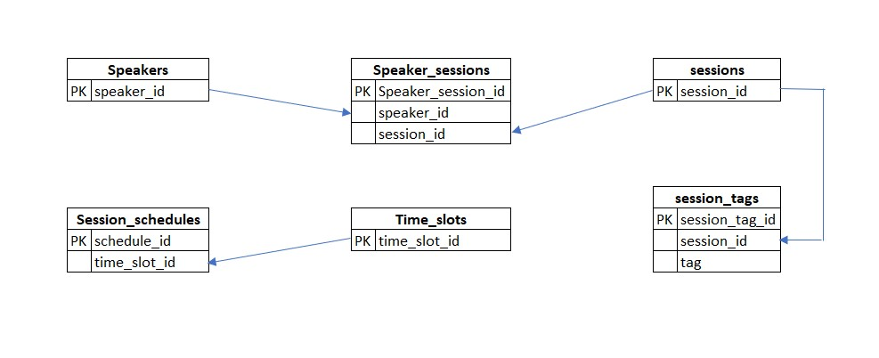
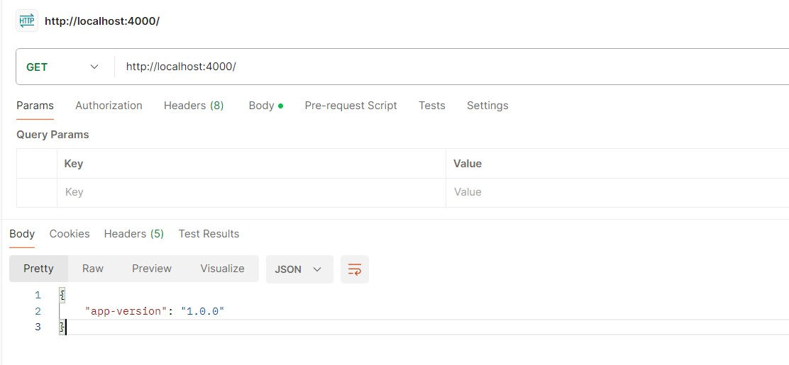
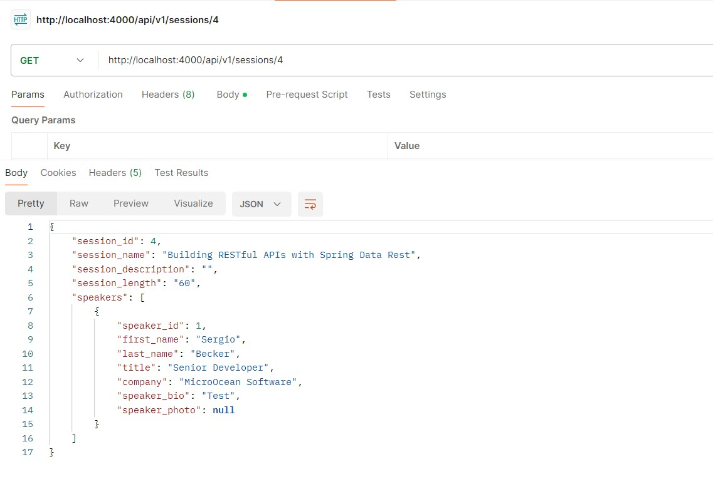
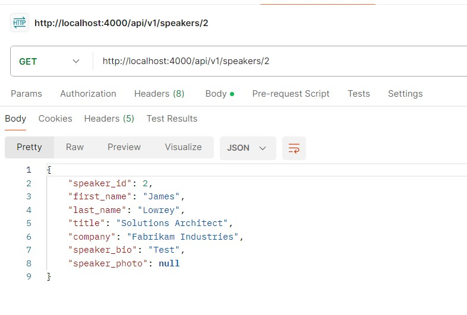
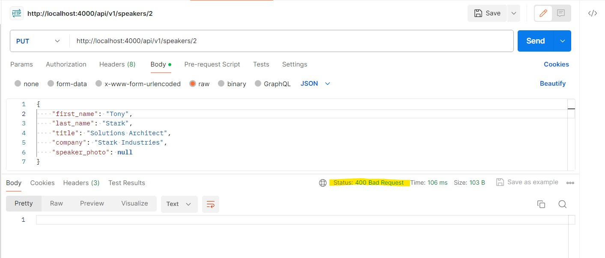
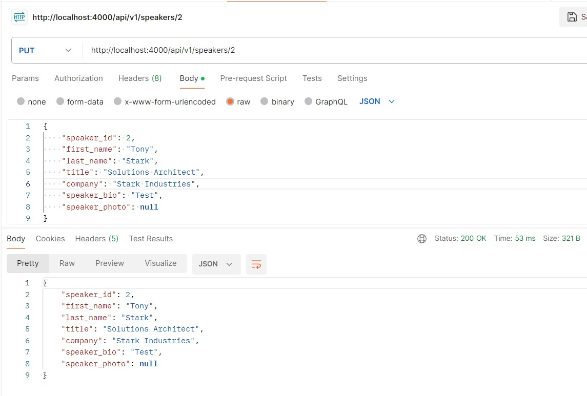
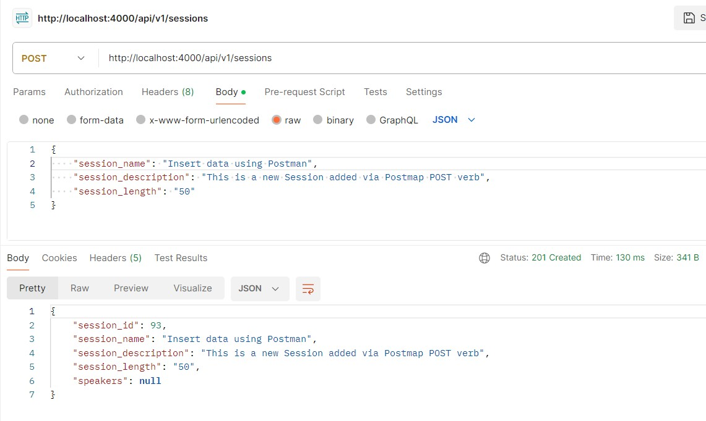
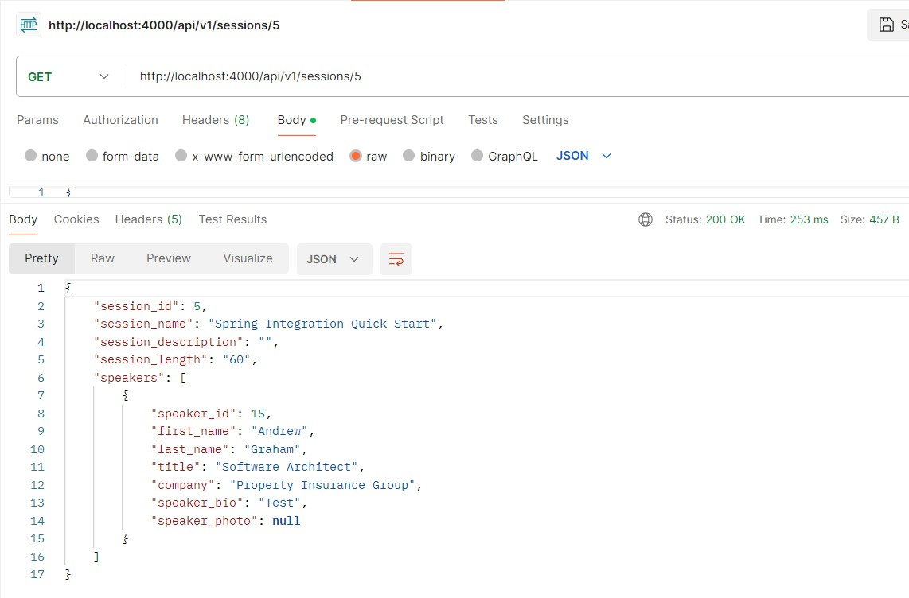
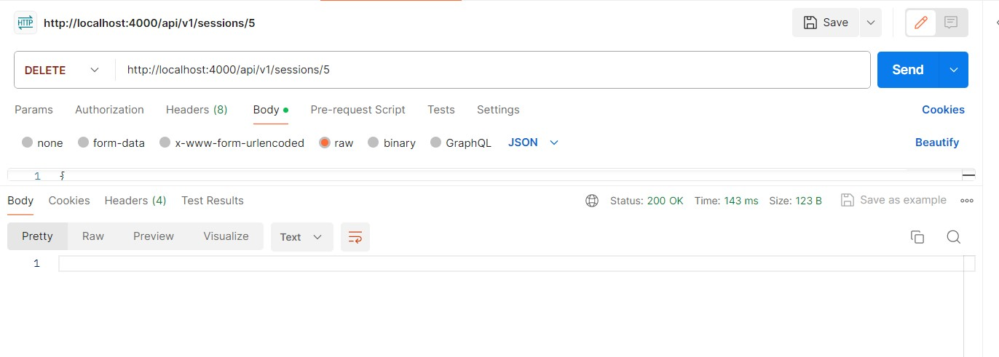
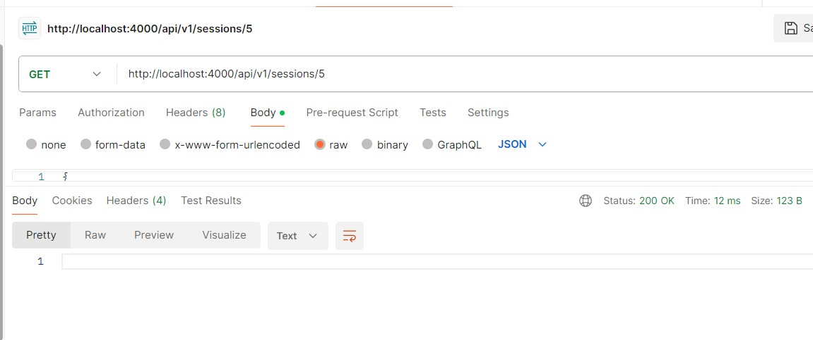

# Conference-Springboot-project

This project is to create a beginner-friendly Conference scheduling app using Spring Boot. This includes spring MVC, spring data JPA, JPA, and a relational database such as MySQL. 
This is a system to maintain many meetings scheduled and speakers for the meetings. It has functionalities like add, retrieve, delete, and update operations on Meetings and Speakers.
This readme file includes all step-by-step details of the project.

Data Design of Conference: 
`There are multiple sessions scheduled on different dates, each having unique session names.
Each session has multiple speakers. Each session will cover different topics. 
Multiple sessions can cover a topic and the same speaker can take multiple sessions.`



Spring boot has spring-boot-starter-web and spring-boot-starter-data-jpa starters that we need to declare so that it automatically places all dependencies in place.
All dependencies in Maven-based projects are placed in the `pom.xml` file. In this project, we have `spring-boot-starter-web`.
The starter-boot-parent declares the version of all possible versions of springboot, also called BOM(Bill of Material).
To see BOM go to `pom.xml` --> right click --> select 'maven' --> select 'show effective pom'. It shows all the framework spring integrated and brought in.

### 1. Add the below dependencies in the POM.xml file:
For data JPA starter:
```xml
    <dependency>
    <groupId>org.springframework.boot</groupId>
    <artifactId>spring-boot-starter-data-jpa</artifactId>
    </dependency> 
```

For MySQL:
```xml
<dependency>
    <groupId>com.mysql</groupId>
    <artifactId>mysql-connector-j</artifactId>
    <scope>runtime</scope>
</dependency>
```

### 2. Add db connections in the properties file
```java
    spring.datasource.url=${DB_URL}
    spring.datasource.username=${DB_USERNAME}
    spring.datasource.password=${DB_PASSWORD}
```

### 3. Setup structure as per MVC architecture
i. Controllers: holds API controllers.\
ii. Models: JPA entities and other persistent info to talk to DB entities.\
iii. Repositories: JPA repositories.\
iv. Services: service or logic-based code that is needed for the application.

#### models:
1. class Session --> for sessions table
2. class Speaker --> for speakers table
Mention their primary key and getters and setters.\
declare the table columns as attributes of the class, using the same name as the db columns to make sure JPA auto binds the columns otherwise we can use @Column annotation to map each column with class attributes\
@Id annotation is used to identify which attribute is the primary key\
@GeneratedValue identifies how the primary key record gets populated in the new record. Identity strategy JPA will utilize MySQL autoincrement sequence for primary key value\

Tie the model classes to the JPA relationship to match the DB table relationship. In this case, it is a many-to-many relationship.\
We need to make one class as the relationship's owner/main definition point. Let's take a session class, and add a list of speakers in it.\
```java
    private List<Speaker> speakers;
```

**For setting up ManyToMany relationship**, we can define a Join Table (The db table that holds ManyToMany relationship) \
@joinColumns define the foreign keys, joinColumn is its own class tables' column, and inverseJoinColumn is the other table's column.\
```java
    @ManyToMany
    @JoinTable(
        name = "session_speakers",
        joinColumns = @JoinColumn(name = "session_id"),
        inverseJoinColumns = @JoinColumn(name = "speaker_id"))
```

In the Speaker class map it to the other side of the relationship by the speakers
```java
    @ManyToMany(mappedBy = "speakers")
    private List<Session> sessions;
```

**As BLOB datatype** is a binary data, use byte[] array and use the Lob annotations for Binary data.\
@Lob - large object as binary data can get very long. It helps JPA to deal with the large data.\
@Column - mapping it with the BLOB column of the table

```java
    @Lob
    @Column(name = "speaker_photo", columnDefinition = "BLOB")
    private byte[] speaker_photo;
```

Add below to properties file, so that JDBC can create a Lob correctly on the java side and BLOB type is correctly mapped to database\
```java
    spring.jpa.properties.hibernate.dialect=org.hibernate.dialect.MySQLDialect
```


#### repositories:
It is the data access layer. We will use Spring Data JPA repositories interfaces. For this we needed 'spring-boot-starter-data-jpa' dependency in the pom.xml file\
JpaRepository provides all CRUD operations. By creating repositories, select, update, insert, and delete all are already set up and usable for Session and Speaker JPA class. 

1. interface SessionRepository extends JpaRepository<Session,Long> -- Session datatype and Long is the PK datatype
2. interface SpeakerRepository extends JpaRepository<Speaker,Long> -- Speaker datatype and Long is the PK datatype

#### Controllers:
Controllers are used to handle API endpoints which are REST based.

1. SessionsController
2. SpeakerController

Both the classes have list() and get() method:
1. list() -- list endpoint, it will return all the Session when called. To query all the sessions in the DB and return them as a list of Session objects. Spring MVC will pass that over to Jackson(serialization library), which will turn those sessions into JSON and return them back to the caller.\
2. get() -- returns and queries the session based on parameter "id" back to the caller in JSON payload
3. create() -- create/insert new data from JSON payload to DB
4. delete() -- deletes data from DB tables
5. update() -- updates a session/speaker record

Annotations and their meaning:  

- **@RestController** -- responds to payloads incoming and outgoing as JSON REST endpoints.\
- **@RequestMapping("/api/v1/sessions")** -- tells the router what the mapping URL looks like. All requests to URL will be sent to this controller.\
- **@Autowired** -- Autowire/inject the SessionRepository when sessionController is build. It will create an instance of SessionRepository and put it into our class\
- **@GetMapping** -- tells which HTTP verb to use, which will be a "GET" verb to call this endpoint\
- **@RequestMapping("{id}")** -- addition to class RequestMapping. Adding id to the URL "/api/v1/sessions". The id specifies a specific session, and we want to return that.\
- **@PathVariable Long id** -- pulling id of the URL and injecting into Get method\
- **@ResponseStatus(HttpStatus.CREATED)** -- By default, the REST controllers return 200s as the response status for all calls. To override this need to @ResponseStatus. @ResponseStatus helps to specify the exact response that we want to occur when the method executes/finishes. HttpStatus.CREATED --> is mapped to 201\
- **@PostMapping** -- requiring the HTTP verb "POST" to be presented with this API call. 
- **@RequestBody** -- Spring MVC taking in all the attributes in the JSON payload and automatically marshaling them into a session object.
- **@RequestMapping**(value = "{id}", method = RequestMethod.DELETE) -- specifies required to pass specific id. the RequestMethod Delete required the HTTP verb "DELETE" presented with this API endpoint.
- **@RequestMapping**(value = "{id}", method = RequestMethod.PUT) -- getting the "id" from URL and using HTTP verb "PUT". There are options PUT/PATCH. PUT will replace all the attributes on the record that you are updating. PATCH will allow just a portion of the attribute to be updated.


* saveAndFlush -- we can save objects as we are working with it, but it does not get committed to db until flushed. saveAndFlush method helps to save the data and flush into db all together. 


**Cyclical data Serialization issue**
Resolve via Jackson Properties
@JsonIgnore in Speaker -- from Jackson library at the receiver side(speaker) of Many to many relationships. Prevents it from back serialization back to the sessions.
@JsonIgnoreProperties({"hibernateLazyInitializer", "handler"}) in Session -- Ignoring a property called hibernateLazyInitializer and handler property. Hibernate adds few stub methods to handle lazy/eager loading of the relational data. This will try to load all relational data with SQL.


## Test ##
Test the APIs using Postman using GET/POST verbs. 
We used port 4000 and got `Tomcat started on port 4000 (http) with context path` after running the app, so we pass http://localhost:4000/

### Home ###
Use GET verb in home 'http://localhost:4000/'



### Select ###
As the mapping url was '/api/v1/sessions' use 'http://localhost:4000/api/v1/sessions' to get all sessions.
To get specific session by id, http://localhost:4000/api/v1/sessions/<id>


### Update ###
Data retrieved before update


Use POST verb to update data, pass id to update the specific id. If any of the attributes are not present in the payload it will return 400 Bad request.


Otherwise, 200 OK status is returned.


### Insert ###
Use POST verb with http://localhost:4000/api/v1/sessions/ to insert data. Autoincrement session id will be generated.


Create new Session:
201 HTTP Status - Created
A 201 status code indicates that a request was successful and as a result, a resource has been created (for example a new page).

### Delete ##
Before deleting


Deleting session with id 4. Use DELETE verb and pass 4 id. Output 200 ok.


After delete try to retrieve the id 4 session, it is not available.



