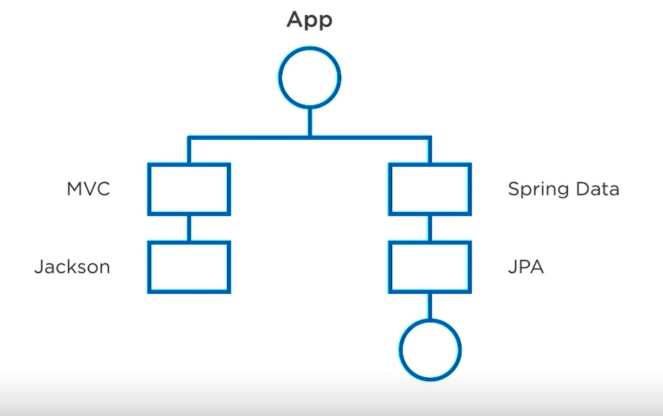

# Spring-Demo-Conference-Pluralsight

This project is to create a beginner-friendly Conference scheduling app using Spring Boot. This includes spring MVC, spring data JPA, JPA, and a relational database such as MySQL. 
This is a system to maintain many meetings scheduled and speakers for the meetings. It has functionalities like add, retrieve, delete, update operations on Meetings and Speakers.

Data Design of Conference: 
`There are multiple sessions scheduled in different dates, each having unique session names.
Each session has multiple speakers. Each session will cover different topics. 
Multiple session can cover a topic and same speaker can take multiple sessions.`

Spring boot have spring-boot-starter-web and spring-boot-starter-data-jpa starters that we need to declare so that it automatically places all dependencies in place.

All dependencies in Maven based projects are placed in `pom.xml` file. In this project we have `spring-boot-starter-web`.
The starter-boot-parent declares the version of all possible versions of springboot, also called BOM(Bill of Material).
To see BOM go to `pom.xml` --> right click --> select 'maven' --> select 'show effective pom'. It shows all the framework spring integrated and brought in.

### 1. Add below dependencies in POM.xml file:
For data JPA starter:
`<dependency>
<groupId>org.springframework.boot</groupId>
<artifactId>spring-boot-starter-data-jpa</artifactId>
</dependency>`

For MySQL:
`<dependency>
    <groupId>com.mysql</groupId>
    <artifactId>mysql-connector-j</artifactId>
    <scope>runtime</scope>
</dependency>`

### 2. Add db connections in properties file

### 3. Setup structure as per MVC architecture
i. controllers : holds API controllers.\
ii. models : JPA entities and other persistent info to talk to db entities.\
iii. repositories : JPA repositories.\
iv. services : service or logic based code that needed for the application.

##### models:
1. class Session --> for sessions table
2. class Speaker --> for speakers table
Mention their primary key and getters and setters.\
declare the table columns as attributes of the class, using same name as the db columns to make sure JPA auto binds the columns otherwise we can use @Column annotation to map each column with class attributes\
@Id annotation is used to identify which attribute is primary key\
@GeneratedValue identifies how the primary key record gets populated in new record. Identity strategy JPA will utilize MySQL autoincrement sequence for primary key value\

Tie the model classes to JPA relationship to match DB table relationship. In this case it is many-to-many relationship.\
We need to make one class as the owner/main definition point of the relationship. Let's take session class, and add list of speakers in it.\
    `private List<Speaker> speakers;`

**For setting up ManyToMany relationship**, we can define a Join Table (The db table that holds ManyToMany relationship) \
@joinColumns defines the foreign keys, joinColumn is its own class tables' column, inverseJoinColumn is the other table's column.\
    `@ManyToMany
    @JoinTable(
        name = "session_speakers",
        joinColumns = @JoinColumn(name = "session_id"),
        inverseJoinColumns = @JoinColumn(name = "speaker_id"))`

In Speaker class map it to other side of the relationship by speakers
    `@ManyToMany(mappedBy = "speakers")
    private List<Session> sessions;`

**As BLOB datatype** is a binary data, use byte[] array and use the Lob annotations for Binary data.\
@Lob - large object as binary data can get very long. It helps JPA to deal with the large data.\
@Column - mapping it with the BLOB column of table

    `@Lob
    @Column(name = "speaker_photo", columnDefinition = "BLOB")
    private byte[] speaker_photo;`

Add below to properties file, so that JDBC can create a Lob correctly on the java side and BLOB type is correctly mapped to database\
    `spring.jpa.properties.hibernate.dialect=org.hibernate.dialect.MySQLDialect`

##### repositories:
It is the data access layer. We will use Spring Data JPA repositories interfaces. For this we needed 'spring-boot-starter-data-jpa' dependency in the pom.xml file\
JpaRepository provides all CRUD operations. By creating repositories, select, update, insert, delete all are already setup and usable for Session and Speaker JPA class. 

1. interface SessionRepository extends JpaRepository<Session,Long> -- Session datatype and Long is the PK datatype
2. interface SpeakerRepository extends JpaRepository<Speaker,Long> -- Speaker datatype and Long is the PK datatype

##### Controllers:
Controllers are used to handle API endpoint, they are REST based.

1. SessionsController
2. SpeakerController

Both the classes have list() and get() method:
1. list() -- list endpoint, it will return all the session when called. To query all the sessions in the DB and return them as a list of Session objects. Spring MVC will pass that over to Jackson(serialization library), which will turn those sessions into JSON and return them back to the caller.\
2. get() -- returns and queries the session based on parameter "id" back to the caller in JSON payload
3. create() -- create/insert new data from JSON payload to DB
4. delete() -- deletes data from DB tables
5. update() -- updates a session/speaker record

Annotations and their meaning:  

@RestController -- responds to payloads incoming and outgoing as JSON REST endpoints.\
@RequestMapping("/api/v1/sessions") -- tells the router what the mapping URL looks like. All requests to URL will be sent to this controller.\
@Autowired -- Autowire/inject the SessionRepository when sessionController is build. It will create an instance of SessionRepository and put it into our class\
@GetMapping -- tells which HTTP verb to use, which will be a "GET" verb to call this endpoint\
@RequestMapping("{id}") -- addition to class RequestMapping. Adding id to the URL "/api/v1/sessions". The id specifies a specific session, and we want to return that.\
@PathVariable Long id -- pulling id of the URL and injecting into Get method\
@ResponseStatus(HttpStatus.CREATED) -- By default, the REST controllers return 200s as the response status for all calls. To override this need to @ResponseStatus. @ResponseStatus helps to specify the exact response that we want to occur when the method executes/finishes. HttpStatus.CREATED --> is mapped to 201\
@PostMapping -- requiring the HTTP verb "POST" to be presented with this API call. 
@RequestBody -- Spring MVC taking in all the attributes in the JSON payload and automatically marshaling them into a session object.
@RequestMapping(value = "{id}", method = RequestMethod.DELETE) -- specifies required to pass specific id. the RequestMethod Delete required the HTTP verb "DELETE" presented with this API endpoint.
@RequestMapping(value = "{id}", method = RequestMethod.PUT) -- getting the "id" from URL and using HTTP verb "PUT". There are options PUT/PATCH. PUT will replace all the attributes on the record that you are updating. PATCH will allow just a portion of the attribute to be updated.
Note:  
* saveAndFlush -- we can save objects as we are working with it, but it does not get committed to db until flushed. saveAndFlush method helps to save the data and flush into db all together. 

Cyclical data Serialization issue
Resolve via Jackson properties or DTO object
@JsonIgnore in Speaker -- from Jackson library at the receiver side(speaker) of Many to many relationship. Prevents it from back serialization back to the sessions.
@JsonIgnoreProperties({"hibernateLazyInitializer", "handler"}) in Session -- Ignoring a property called hibernateLazyInitializer and handler property. Hibernate adds few stub methods to handle lazy/eager loading of the relational data. This will try to load all relational data with SQL.

Test ---
Select

Create new Session:
201 HTTP Status - Created
A 201 status code indicates that a request was successful and as a result, a resource has been created (for example a new page).

Delete

Update

Steps:
Relational Database
Persistence Tier -- Models and JPA repositories
API and controllers -- API end points

Working with Spring boot config and environment needs:

- In staging we should enable full logging, in prod only errors and warnings

where to set Springboot properties
- External sources --> Command line parameters, JNDI, OS environment variables
- Internal sources --> Servlet parameters, property files, java configuration and also can point to external sources

How Springboot handles reading and setting properties:
1. Command line args
2. SPRING_APPLICATION_JSON args
3. Servlet parameters
4. JNDI
5. Java System Properties
6. OS environment variables
7. Profile properties
8. Application properties
9. @PropertySource Annotation
10. Default properties

Ideally: should use 1 internal source(Properties files) to setup application defaults and 1 external source to provide override
can use external sources for sensitive date like Passwords

- Inputs in applications.properties file override the springboot default properties
- Example: server.port has default value 8080 --> when Spring boot application runs it runs on port 8080 by default
    Change it to server.port=4000 . 'Tomcat started on port 4000 (http) with context path'

External sources properties:
For starter we were putting the db url, id password in properties file and when we upload this code base to public git repo, everyone has access to the prod db.
Best way is not hardcode db info in properties file, move it to external environment variable.
Go to Run menu --> edit configuration --> environment variables --> and mention the db info in the environment variable

- How to handle properties file for different environment?
use profiles in name: application-{profile}.properties --> place the file in src/resource folder
                - application-dev.properties
                - application-prod.properties
to specify the profile use in run configuration add below in VM options "~Dspring.profiles.active=prod" --> "prod" keyword should match with file's profile

- Setting properties with YAML
using application.yml file to define port. So JDBC connection will be in application.properties and server port in another file.
YAML files shows hierarchy and nested properties fairly well

- Custom properties
we will create custom property called app.version and create a controller to display app version when called.
For my new application I want the version to be 1.0.0. I want to print it in home of the application ("http://localhost:4000/")
Add below to properties file:
app.version=1.0.0

Create Rest API Controller(HomeController) get "app.version" value from properties file, pass it in a HashMap with a proper key-value pair.
Root/default handler: 

@GetMapping - for GET http verb method
@RequestMapping("/") - "/" for root
public Map getStatus()  --> Jackson will take the Map and convert into JSON payload

@Value("${app.version}") --> checks "app.version" in properties file picks the value and pass into parameter

- Override Springboot properties with JAVA config
Add all JAVA configurations in config package and annotate with "@Configuration" to tell it is an configuration class
Methods defined in configuration class returns bean definitions that will get stored in Spring context.
We can override the data source being provided by the Spring JPA starter

@Bean - to make Spring understand the method returns a Bean to be managed by Spring context. Bean is an object that is instantiated, assembled and managed by a Spring IOC container.

Using DataSourceBuilder pass url, id and password of DB connection and then return builder.build(), which returns DataSource object.
